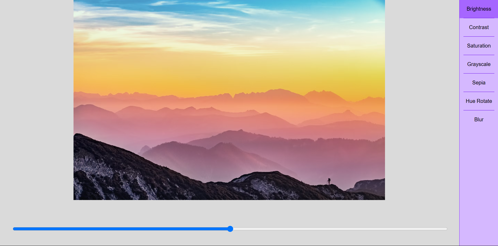

# 🖼️ Image Filter Editor (React)

This is a simple image filter editor built using **React**. It allows users to apply and adjust various CSS-based filters to an image in real time using sliders.

## 🚀 Features

- Live filter preview
- Adjustable controls for:
  - Brightness
  - Contrast
  - Saturation
  - Grayscale
  - Sepia
  - Hue Rotation
  - Blur
- Clean, minimal sidebar UI for selecting filters
- Responsive slider for each filter property

## 📸 Demo



## 🛠️ Technologies Used

- React (Functional Components & Hooks)
- CSS Filters
- Vite (for fast development setup)


## 🧑‍💻 Getting Started

### 1. Clone the Repository

```bash
git clone https://github.com/AnkitKumar666/React-PhotoshopClone.git
cd React-PhotoshopClone
```

2. **Install and Run Command**
```bash
npm install
npm run dev
```


